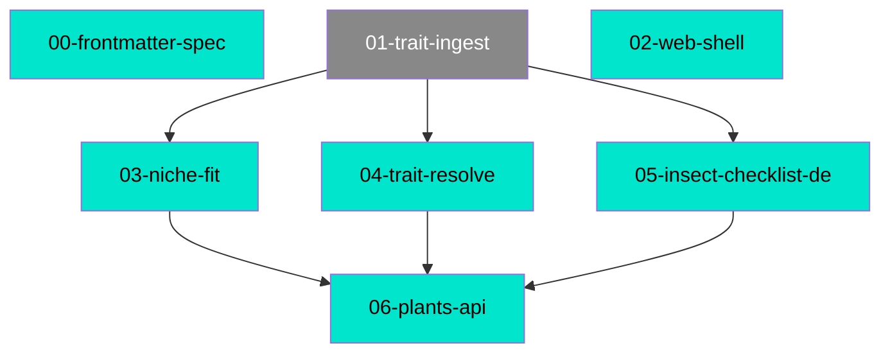

# Connections

## Path Tree

API/Plants
  └── 06-plants-api  complete
Data/Ingest
  └── 01-trait-ingest  draft
Data/Interactions
  └── 05-insect-checklist-de  complete
Data/Read
  └── 04-trait-resolve  complete
Matching/Fit
  └── 03-niche-fit  complete
Meta/Schema
  └── 00-frontmatter-spec  complete
Platform/Deploy
  └── 02-web-shell  complete

## Dependency Graph

## Source File Overlap

(none)

## Warnings

(none)
