# Connections

## Path Tree

```text
API
├── Gardens  09-garden-api  complete
├── Plants  06-plants-api  complete
└── Suggestions  13-bed-suggestions  complete
Auth
├── Accounts  35-accounts  complete
└── Ownership  36-claim-gardens  complete
Bloom
├── MonthSuggestions  24-month-suggestions  complete
└── Playback  29-bloom-playback  complete
Canvas
├── Bloom  56-bloom-dots  complete
├── Delete  57-delete-elements  complete
├── Focus  49-drawing-focus  complete
├── Freehand  40-freehand-shapes  complete
├── Freehand  46-freehand-paths  complete
├── Layout  47-panel-order  complete
├── List  52-element-list  complete
├── Menu  51-element-context-menu  complete
├── Polygon  50-polygon-closing  complete
├── Relabel  45-relabel-and-skin  complete
├── Shapes  43-shape-tools  complete
├── Stamps  39-element-stamps  complete
├── Style  41-garden-style  complete
├── Style  58-painted-plan  complete
├── Style  95-look-before-you-argue  complete
├── Style  96-a-theme-is-a-thing  complete
├── Style  97-draft-sketch-in-svg  complete
├── Style  98-what-the-style-has-not-drawn  complete
└── Vertices  44-vertex-editing  complete
Data
├── Colour  62-manual-colours  complete
├── Info  22-species-info  complete
├── Ingest  01-trait-ingest  draft
├── Insects  17-insect-groups  complete
├── Interactions  05-insect-checklist-de  complete
├── Names  21-german-names  draft
├── Nativeness  16-nativeness  complete
├── Partners  25-woody-and-birds  complete
└── Read  04-trait-resolve  complete
Frontend
├── Canvas  11-garden-canvas  complete
├── Client  10-web-client  complete
├── Score  20-score-ui  complete
└── Timeline  15-timeline-ui  complete
Garden
├── Elements  42-element-model  complete
├── Footprints  37-object-footprints  complete
├── Heights  32-object-heights  complete
├── Imagery  33-imagery-objects  complete
├── Improve  19-swap-suggestions  complete
├── Light  07-solar-geometry  complete
├── Light  64-light-across-the-bed  complete
├── Light  65-the-shade-switch  complete
├── Light  66-a-tree-is-not-a-wall  complete
├── Light  67-sun-plant-in-a-shade-spot  complete
├── Light  71-buildings-stand-on-the-ground  complete
├── Light  72-the-hill-that-eats-the-morning  complete
├── Light  73-which-way-does-it-fall  complete
├── Light  74-say-how-good-it-is  complete
├── Map  31-map-selection  complete
├── Model  08-garden-model  complete
├── Objects  27-object-labelling  complete
├── Plantings  12-planting-model  complete
├── Plantings  28-existing-plantings  complete
├── Score  18-insect-score  complete
├── Sightlines  34-sightlines  complete
├── Soil  48-garden-soil  complete
└── Timeline  14-bloom-timeline  complete
Geo
└── Streets  59-osm-streets  complete
Landing
├── Account  53-account-in-header  complete
├── Background  55-living-background  complete
└── Ways  54-one-way-in  complete
Map
├── Buildings  80-which-models-and-whose  complete
├── Buildings  81-a-house-with-a-measured-height  complete
├── Buildings  82-the-roof-it-actually-has  complete
├── Buildings  83-measured-surveyed-or-assumed  complete
├── Buildings  84-what-else-is-standing-there  complete
├── Buildings  93-where-the-roof-came-from  complete
├── Buildings  94-which-way-the-ridge-runs  complete
├── Surroundings  63-neighbours-from-the-plot  complete
├── Terrain  68-which-ground-and-whose  complete
├── Terrain  69-a-window-of-ground  complete
└── Terrain  70-the-horizon-ring  complete
Matching
└── Fit  03-niche-fit  complete
Meta
└── Schema  00-frontmatter-spec  complete
Operations
└── Security
    └── Report  85-nothing-worse-than-it-looks  complete
Ops
├── Deployment  75-the-branch-that-goes-first  complete
├── Deployment  76-a-second-stack  complete
├── Deployment  77-one-cron-two-environments  complete
├── Deployment  78-you-are-looking-at-the-preview  complete
└── Deployment  79-feedback-knows-where-it-came-from  complete
Plan
└── Plantings  61-planting-clusters  complete
Platform
└── Deploy  02-web-shell  complete
Search
└── Filters  23-catalogue-filters  complete
Solar
└── Shadows  38-polygon-shadows  complete
Support
└── Feedback  60-feedback-box  complete
UI
├── Canvas  26-drawing-canvas  complete
└── Entry  30-landing-and-garden-id  complete
Workspace
├── Inspector  88-what-the-selection-shows  complete
├── Inspector  89-three-steps-in  complete
├── Inspector  90-a-list-that-fits-a-window  complete
├── Plan  86-the-plan-that-stayed-a-strip  complete
├── Sheet  91-a-sheet-from-below  complete
├── Shell  87-a-workspace-not-a-page  complete
└── Style  92-one-panel-one-style  complete
```

## Dependency Graph

```mermaid
graph TD
    00_frontmatter_spec["00-frontmatter-spec"]:::complete
    01_trait_ingest["01-trait-ingest"]:::draft
    02_web_shell["02-web-shell"]:::complete
    03_niche_fit["03-niche-fit"]:::complete
    01_trait_ingest --> 03_niche_fit
    04_trait_resolve["04-trait-resolve"]:::complete
    01_trait_ingest --> 04_trait_resolve
    05_insect_checklist_de["05-insect-checklist-de"]:::complete
    01_trait_ingest --> 05_insect_checklist_de
    06_plants_api["06-plants-api"]:::complete
    03_niche_fit --> 06_plants_api
    04_trait_resolve --> 06_plants_api
    05_insect_checklist_de --> 06_plants_api
    07_solar_geometry["07-solar-geometry"]:::complete
    08_garden_model["08-garden-model"]:::complete
    07_solar_geometry --> 08_garden_model
    09_garden_api["09-garden-api"]:::complete
    07_solar_geometry --> 09_garden_api
    08_garden_model --> 09_garden_api
    10_web_client["10-web-client"]:::complete
    09_garden_api --> 10_web_client
    11_garden_canvas["11-garden-canvas"]:::complete
    10_web_client --> 11_garden_canvas
    12_planting_model["12-planting-model"]:::complete
    08_garden_model --> 12_planting_model
    13_bed_suggestions["13-bed-suggestions"]:::complete
    12_planting_model --> 13_bed_suggestions
    06_plants_api --> 13_bed_suggestions
    14_bloom_timeline["14-bloom-timeline"]:::complete
    12_planting_model --> 14_bloom_timeline
    05_insect_checklist_de --> 14_bloom_timeline
    15_timeline_ui["15-timeline-ui"]:::complete
    13_bed_suggestions --> 15_timeline_ui
    14_bloom_timeline --> 15_timeline_ui
    16_nativeness["16-nativeness"]:::complete
    01_trait_ingest --> 16_nativeness
    17_insect_groups["17-insect-groups"]:::complete
    05_insect_checklist_de --> 17_insect_groups
    18_insect_score["18-insect-score"]:::complete
    16_nativeness --> 18_insect_score
    17_insect_groups --> 18_insect_score
    14_bloom_timeline --> 18_insect_score
    19_swap_suggestions["19-swap-suggestions"]:::complete
    18_insect_score --> 19_swap_suggestions
    13_bed_suggestions --> 19_swap_suggestions
    20_score_ui["20-score-ui"]:::complete
    18_insect_score --> 20_score_ui
    19_swap_suggestions --> 20_score_ui
    21_german_names["21-german-names"]:::draft
    01_trait_ingest --> 21_german_names
    22_species_info["22-species-info"]:::complete
    21_german_names --> 22_species_info
    23_catalogue_filters["23-catalogue-filters"]:::complete
    21_german_names --> 23_catalogue_filters
    24_month_suggestions["24-month-suggestions"]:::complete
    23_catalogue_filters --> 24_month_suggestions
    25_woody_and_birds["25-woody-and-birds"]:::complete
    17_insect_groups --> 25_woody_and_birds
    26_drawing_canvas["26-drawing-canvas"]:::complete
    27_object_labelling["27-object-labelling"]:::complete
    26_drawing_canvas --> 27_object_labelling
    28_existing_plantings["28-existing-plantings"]:::complete
    27_object_labelling --> 28_existing_plantings
    29_bloom_playback["29-bloom-playback"]:::complete
    26_drawing_canvas --> 29_bloom_playback
    30_landing_and_garden_id["30-landing-and-garden-id"]:::complete
    26_drawing_canvas --> 30_landing_and_garden_id
    31_map_selection["31-map-selection"]:::complete
    26_drawing_canvas --> 31_map_selection
    32_object_heights["32-object-heights"]:::complete
    31_map_selection --> 32_object_heights
    33_imagery_objects["33-imagery-objects"]:::complete
    31_map_selection --> 33_imagery_objects
    34_sightlines["34-sightlines"]:::complete
    27_object_labelling --> 34_sightlines
    35_accounts["35-accounts"]:::complete
    36_claim_gardens["36-claim-gardens"]:::complete
    35_accounts --> 36_claim_gardens
    37_object_footprints["37-object-footprints"]:::complete
    27_object_labelling --> 37_object_footprints
    38_polygon_shadows["38-polygon-shadows"]:::complete
    37_object_footprints --> 38_polygon_shadows
    39_element_stamps["39-element-stamps"]:::complete
    37_object_footprints --> 39_element_stamps
    40_freehand_shapes["40-freehand-shapes"]:::complete
    39_element_stamps --> 40_freehand_shapes
    41_garden_style["41-garden-style"]:::complete
    37_object_footprints --> 41_garden_style
    39_element_stamps --> 41_garden_style
    42_element_model["42-element-model"]:::complete
    37_object_footprints --> 42_element_model
    43_shape_tools["43-shape-tools"]:::complete
    42_element_model --> 43_shape_tools
    44_vertex_editing["44-vertex-editing"]:::complete
    43_shape_tools --> 44_vertex_editing
    45_relabel_and_skin["45-relabel-and-skin"]:::complete
    42_element_model --> 45_relabel_and_skin
    46_freehand_paths["46-freehand-paths"]:::complete
    43_shape_tools --> 46_freehand_paths
    47_panel_order["47-panel-order"]:::complete
    43_shape_tools --> 47_panel_order
    48_garden_soil["48-garden-soil"]:::complete
    47_panel_order --> 48_garden_soil
    49_drawing_focus["49-drawing-focus"]:::complete
    43_shape_tools --> 49_drawing_focus
    50_polygon_closing["50-polygon-closing"]:::complete
    43_shape_tools --> 50_polygon_closing
    51_element_context_menu["51-element-context-menu"]:::complete
    45_relabel_and_skin --> 51_element_context_menu
    52_element_list["52-element-list"]:::complete
    51_element_context_menu --> 52_element_list
    53_account_in_header["53-account-in-header"]:::complete
    54_one_way_in["54-one-way-in"]:::complete
    53_account_in_header --> 54_one_way_in
    55_living_background["55-living-background"]:::complete
    56_bloom_dots["56-bloom-dots"]:::complete
    57_delete_elements["57-delete-elements"]:::complete
    51_element_context_menu --> 57_delete_elements
    58_painted_plan["58-painted-plan"]:::complete
    41_garden_style --> 58_painted_plan
    59_osm_streets["59-osm-streets"]:::complete
    42_element_model --> 59_osm_streets
    31_map_selection --> 59_osm_streets
    60_feedback_box["60-feedback-box"]:::complete
    61_planting_clusters["61-planting-clusters"]:::complete
    62_manual_colours["62-manual-colours"]:::complete
    63_neighbours_from_the_plot["63-neighbours-from-the-plot"]:::complete
    64_light_across_the_bed["64-light-across-the-bed"]:::complete
    65_the_shade_switch["65-the-shade-switch"]:::complete
    64_light_across_the_bed --> 65_the_shade_switch
    66_a_tree_is_not_a_wall["66-a-tree-is-not-a-wall"]:::complete
    64_light_across_the_bed --> 66_a_tree_is_not_a_wall
    67_sun_plant_in_a_shade_spot["67-sun-plant-in-a-shade-spot"]:::complete
    64_light_across_the_bed --> 67_sun_plant_in_a_shade_spot
    68_which_ground_and_whose["68-which-ground-and-whose"]:::complete
    69_a_window_of_ground["69-a-window-of-ground"]:::complete
    68_which_ground_and_whose --> 69_a_window_of_ground
    70_the_horizon_ring["70-the-horizon-ring"]:::complete
    68_which_ground_and_whose --> 70_the_horizon_ring
    69_a_window_of_ground --> 70_the_horizon_ring
    71_buildings_stand_on_the_ground["71-buildings-stand-on-the-ground"]:::complete
    69_a_window_of_ground --> 71_buildings_stand_on_the_ground
    72_the_hill_that_eats_the_morning["72-the-hill-that-eats-the-morning"]:::complete
    70_the_horizon_ring --> 72_the_hill_that_eats_the_morning
    71_buildings_stand_on_the_ground --> 72_the_hill_that_eats_the_morning
    73_which_way_does_it_fall["73-which-way-does-it-fall"]:::complete
    69_a_window_of_ground --> 73_which_way_does_it_fall
    74_say_how_good_it_is["74-say-how-good-it-is"]:::complete
    69_a_window_of_ground --> 74_say_how_good_it_is
    75_the_branch_that_goes_first["75-the-branch-that-goes-first"]:::complete
    76_a_second_stack["76-a-second-stack"]:::complete
    75_the_branch_that_goes_first --> 76_a_second_stack
    77_one_cron_two_environments["77-one-cron-two-environments"]:::complete
    76_a_second_stack --> 77_one_cron_two_environments
    78_you_are_looking_at_the_preview["78-you-are-looking-at-the-preview"]:::complete
    76_a_second_stack --> 78_you_are_looking_at_the_preview
    79_feedback_knows_where_it_came_from["79-feedback-knows-where-it-came-from"]:::complete
    78_you_are_looking_at_the_preview --> 79_feedback_knows_where_it_came_from
    80_which_models_and_whose["80-which-models-and-whose"]:::complete
    68_which_ground_and_whose --> 80_which_models_and_whose
    81_a_house_with_a_measured_height["81-a-house-with-a-measured-height"]:::complete
    80_which_models_and_whose --> 81_a_house_with_a_measured_height
    69_a_window_of_ground --> 81_a_house_with_a_measured_height
    82_the_roof_it_actually_has["82-the-roof-it-actually-has"]:::complete
    80_which_models_and_whose --> 82_the_roof_it_actually_has
    83_measured_surveyed_or_assumed["83-measured-surveyed-or-assumed"]:::complete
    81_a_house_with_a_measured_height --> 83_measured_surveyed_or_assumed
    82_the_roof_it_actually_has --> 83_measured_surveyed_or_assumed
    84_what_else_is_standing_there["84-what-else-is-standing-there"]:::complete
    80_which_models_and_whose --> 84_what_else_is_standing_there
    81_a_house_with_a_measured_height --> 84_what_else_is_standing_there
    85_nothing_worse_than_it_looks["85-nothing-worse-than-it-looks"]:::complete
    86_the_plan_that_stayed_a_strip["86-the-plan-that-stayed-a-strip"]:::complete
    11_garden_canvas --> 86_the_plan_that_stayed_a_strip
    26_drawing_canvas --> 86_the_plan_that_stayed_a_strip
    87_a_workspace_not_a_page["87-a-workspace-not-a-page"]:::complete
    86_the_plan_that_stayed_a_strip --> 87_a_workspace_not_a_page
    11_garden_canvas --> 87_a_workspace_not_a_page
    47_panel_order --> 87_a_workspace_not_a_page
    49_drawing_focus --> 87_a_workspace_not_a_page
    52_element_list --> 87_a_workspace_not_a_page
    88_what_the_selection_shows["88-what-the-selection-shows"]:::complete
    87_a_workspace_not_a_page --> 88_what_the_selection_shows
    49_drawing_focus --> 88_what_the_selection_shows
    51_element_context_menu --> 88_what_the_selection_shows
    52_element_list --> 88_what_the_selection_shows
    89_three_steps_in["89-three-steps-in"]:::complete
    88_what_the_selection_shows --> 89_three_steps_in
    87_a_workspace_not_a_page --> 89_three_steps_in
    48_garden_soil --> 89_three_steps_in
    34_sightlines --> 89_three_steps_in
    84_what_else_is_standing_there --> 89_three_steps_in
    90_a_list_that_fits_a_window["90-a-list-that-fits-a-window"]:::complete
    88_what_the_selection_shows --> 90_a_list_that_fits_a_window
    23_catalogue_filters --> 90_a_list_that_fits_a_window
    25_woody_and_birds --> 90_a_list_that_fits_a_window
    15_timeline_ui --> 90_a_list_that_fits_a_window
    91_a_sheet_from_below["91-a-sheet-from-below"]:::complete
    87_a_workspace_not_a_page --> 91_a_sheet_from_below
    88_what_the_selection_shows --> 91_a_sheet_from_below
    90_a_list_that_fits_a_window --> 91_a_sheet_from_below
    92_one_panel_one_style["92-one-panel-one-style"]:::complete
    87_a_workspace_not_a_page --> 92_one_panel_one_style
    91_a_sheet_from_below --> 92_one_panel_one_style
    93_where_the_roof_came_from["93-where-the-roof-came-from"]:::complete
    82_the_roof_it_actually_has --> 93_where_the_roof_came_from
    83_measured_surveyed_or_assumed --> 93_where_the_roof_came_from
    94_which_way_the_ridge_runs["94-which-way-the-ridge-runs"]:::complete
    82_the_roof_it_actually_has --> 94_which_way_the_ridge_runs
    93_where_the_roof_came_from --> 94_which_way_the_ridge_runs
    95_look_before_you_argue["95-look-before-you-argue"]:::complete
    58_painted_plan --> 95_look_before_you_argue
    41_garden_style --> 95_look_before_you_argue
    96_a_theme_is_a_thing["96-a-theme-is-a-thing"]:::complete
    95_look_before_you_argue --> 96_a_theme_is_a_thing
    41_garden_style --> 96_a_theme_is_a_thing
    58_painted_plan --> 96_a_theme_is_a_thing
    97_draft_sketch_in_svg["97-draft-sketch-in-svg"]:::complete
    96_a_theme_is_a_thing --> 97_draft_sketch_in_svg
    95_look_before_you_argue --> 97_draft_sketch_in_svg
    98_what_the_style_has_not_drawn["98-what-the-style-has-not-drawn"]:::complete
    97_draft_sketch_in_svg --> 98_what_the_style_has_not_drawn
    94_which_way_the_ridge_runs --> 98_what_the_style_has_not_drawn
    classDef complete fill:#00e5cc,color:#000
    classDef in_progress fill:#ffaa00,color:#000
    classDef draft fill:#888,color:#fff
    classDef deprecated fill:#555,color:#aaa
```



## Source File Overlap

- `.github/workflows/deploy.yml` — 02-web-shell, 75-the-branch-that-goes-first, 85-nothing-worse-than-it-looks
- `Dockerfile` — 02-web-shell, 11-garden-canvas, 85-nothing-worse-than-it-looks
- `deploy/.env.dev.example` — 76-a-second-stack, 79-feedback-knows-where-it-came-from
- `deploy/SERVER-SETUP.md` — 02-web-shell, 75-the-branch-that-goes-first, 76-a-second-stack, 77-one-cron-two-environments
- `deploy/auto-deploy.sh` — 02-web-shell, 85-nothing-worse-than-it-looks
- `deploy/compose.app.yml` — 02-web-shell, 76-a-second-stack, 85-nothing-worse-than-it-looks
- `deploy/install-cron.sh` — 02-web-shell, 77-one-cron-two-environments
- `frontend/package.json` — 10-web-client, 95-look-before-you-argue
- `frontend/scripts/plan-sheet.mjs` — 95-look-before-you-argue, 97-draft-sketch-in-svg, 98-what-the-style-has-not-drawn
- `frontend/src/App.tsx` — 11-garden-canvas, 15-timeline-ui, 20-score-ui, 22-species-info, 23-catalogue-filters, 24-month-suggestions, 27-object-labelling, 29-bloom-playback, 30-landing-and-garden-id, 32-object-heights, 36-claim-gardens, 39-element-stamps, 47-panel-order, 53-account-in-header, 54-one-way-in, 57-delete-elements, 86-the-plan-that-stayed-a-strip, 87-a-workspace-not-a-page, 97-draft-sketch-in-svg
- `frontend/src/api/client.ts` — 10-web-client, 15-timeline-ui, 35-accounts, 78-you-are-looking-at-the-preview, 90-a-list-that-fits-a-window
- `frontend/src/api/types.ts` — 10-web-client, 15-timeline-ui, 93-where-the-roof-came-from, 94-which-way-the-ridge-runs, 98-what-the-style-has-not-drawn
- `frontend/src/canvas/freehand.ts` — 40-freehand-shapes, 46-freehand-paths, 50-polygon-closing
- `frontend/src/canvas/geometry.ts` — 26-drawing-canvas, 40-freehand-shapes, 56-bloom-dots
- `frontend/src/canvas/handles.ts` — 39-element-stamps, 43-shape-tools
- `frontend/src/canvas/shapes.ts` — 43-shape-tools, 89-three-steps-in
- `frontend/src/canvas/sketch.ts` — 97-draft-sketch-in-svg, 98-what-the-style-has-not-drawn
- `frontend/src/canvas/useClusterDrag.ts` — 61-planting-clusters, 87-a-workspace-not-a-page
- `frontend/src/canvas/useEscapeKey.ts` — 49-drawing-focus, 88-what-the-selection-shows
- `frontend/src/canvas/viewport.ts` — 26-drawing-canvas, 86-the-plan-that-stayed-a-strip, 96-a-theme-is-a-thing
- `frontend/src/components/BedDetails.tsx` — 88-what-the-selection-shows, 90-a-list-that-fits-a-window
- `frontend/src/components/BedPanel.tsx` — 11-garden-canvas, 15-timeline-ui, 39-element-stamps, 47-panel-order, 73-which-way-does-it-fall, 88-what-the-selection-shows, 92-one-panel-one-style
- `frontend/src/components/BedPlantings.tsx` — 61-planting-clusters, 89-three-steps-in
- `frontend/src/components/BloomTimeline.tsx` — 15-timeline-ui, 24-month-suggestions, 89-three-steps-in, 92-one-panel-one-style
- `frontend/src/components/CanopyBox.tsx` — 84-what-else-is-standing-there, 89-three-steps-in
- `frontend/src/components/CanvasControls.tsx` — 26-drawing-canvas, 40-freehand-shapes, 89-three-steps-in
- `frontend/src/components/CanvasScene.tsx` — 26-drawing-canvas, 27-object-labelling, 29-bloom-playback, 34-sightlines, 41-garden-style, 49-drawing-focus, 51-element-context-menu, 56-bloom-dots, 65-the-shade-switch, 88-what-the-selection-shows, 89-three-steps-in, 96-a-theme-is-a-thing, 97-draft-sketch-in-svg, 98-what-the-style-has-not-drawn
- `frontend/src/components/ClusterLayer.tsx` — 61-planting-clusters, 88-what-the-selection-shows
- `frontend/src/components/ElementDetails.tsx` — 51-element-context-menu, 88-what-the-selection-shows
- `frontend/src/components/ElementForm.tsx` — 51-element-context-menu, 88-what-the-selection-shows, 93-where-the-roof-came-from, 94-which-way-the-ridge-runs
- `frontend/src/components/ElementList.tsx` — 52-element-list, 83-measured-surveyed-or-assumed, 89-three-steps-in
- `frontend/src/components/FilterControls.tsx` — 23-catalogue-filters, 90-a-list-that-fits-a-window
- `frontend/src/components/GardenCanvas.tsx` — 11-garden-canvas, 26-drawing-canvas, 39-element-stamps, 40-freehand-shapes, 43-shape-tools, 49-drawing-focus, 86-the-plan-that-stayed-a-strip, 87-a-workspace-not-a-page, 88-what-the-selection-shows, 89-three-steps-in, 97-draft-sketch-in-svg, 98-what-the-style-has-not-drawn
- `frontend/src/components/GardenDetails.tsx` — 52-element-list, 88-what-the-selection-shows, 89-three-steps-in
- `frontend/src/components/GardenId.tsx` — 30-landing-and-garden-id, 87-a-workspace-not-a-page, 89-three-steps-in
- `frontend/src/components/GardenSymbols.tsx` — 41-garden-style, 58-painted-plan, 59-osm-streets
- `frontend/src/components/GardenWorkspace.tsx` — 87-a-workspace-not-a-page, 89-three-steps-in, 91-a-sheet-from-below, 92-one-panel-one-style
- `frontend/src/components/InsectScore.tsx` — 20-score-ui, 89-three-steps-in
- `frontend/src/components/Inspector.tsx` — 87-a-workspace-not-a-page, 91-a-sheet-from-below
- `frontend/src/components/InspectorPanels.tsx` — 87-a-workspace-not-a-page, 88-what-the-selection-shows, 89-three-steps-in
- `frontend/src/components/Landing.tsx` — 30-landing-and-garden-id, 53-account-in-header, 54-one-way-in
- `frontend/src/components/MapPicker.tsx` — 31-map-selection, 32-object-heights, 33-imagery-objects
- `frontend/src/components/ObjectEditor.tsx` — 27-object-labelling, 39-element-stamps, 45-relabel-and-skin, 46-freehand-paths, 48-garden-soil
- `frontend/src/components/PlanArea.tsx` — 87-a-workspace-not-a-page, 88-what-the-selection-shows, 89-three-steps-in
- `frontend/src/components/PlanCredit.tsx` — 97-draft-sketch-in-svg, 98-what-the-style-has-not-drawn
- `frontend/src/components/PlanDecorations.tsx` — 97-draft-sketch-in-svg, 98-what-the-style-has-not-drawn
- `frontend/src/components/PlanObjects.tsx` — 96-a-theme-is-a-thing, 97-draft-sketch-in-svg, 98-what-the-style-has-not-drawn
- `frontend/src/components/ResizeHandles.tsx` — 39-element-stamps, 43-shape-tools
- `frontend/src/components/ShadeSwitch.tsx` — 65-the-shade-switch, 67-sun-plant-in-a-shade-spot, 74-say-how-good-it-is, 87-a-workspace-not-a-page
- `frontend/src/components/SiteHeader.tsx` — 87-a-workspace-not-a-page, 91-a-sheet-from-below
- `frontend/src/components/SpeciesInfo.tsx` — 22-species-info, 88-what-the-selection-shows
- `frontend/src/components/SuggestionList.tsx` — 15-timeline-ui, 22-species-info, 23-catalogue-filters, 24-month-suggestions, 25-woody-and-birds, 90-a-list-that-fits-a-window
- `frontend/src/components/ToolRail.tsx` — 87-a-workspace-not-a-page, 89-three-steps-in
- `frontend/src/garden/selection.ts` — 88-what-the-selection-shows, 93-where-the-roof-came-from, 94-which-way-the-ridge-runs
- `frontend/src/garden/useClipboard.ts` — 87-a-workspace-not-a-page, 88-what-the-selection-shows
- `frontend/src/garden/useElements.ts` — 87-a-workspace-not-a-page, 88-what-the-selection-shows
- `frontend/src/garden/useGarden.ts` — 87-a-workspace-not-a-page, 88-what-the-selection-shows, 89-three-steps-in
- `frontend/src/garden/useSelection.ts` — 51-element-context-menu, 52-element-list, 88-what-the-selection-shows
- `frontend/src/garden/useSuggestions.ts` — 87-a-workspace-not-a-page, 88-what-the-selection-shows
- `frontend/src/heights.ts` — 83-measured-surveyed-or-assumed, 93-where-the-roof-came-from
- `frontend/src/kinds.ts` — 39-element-stamps, 41-garden-style, 45-relabel-and-skin, 59-osm-streets, 87-a-workspace-not-a-page
- `frontend/src/map/tiles.ts` — 31-map-selection, 33-imagery-objects
- `frontend/src/plural.ts` — 11-garden-canvas, 20-score-ui, 24-month-suggestions, 26-drawing-canvas
- `frontend/src/roofs.ts` — 82-the-roof-it-actually-has, 93-where-the-roof-came-from, 94-which-way-the-ridge-runs
- `frontend/src/sheet/SheetCell.tsx` — 95-look-before-you-argue, 98-what-the-style-has-not-drawn
- `frontend/src/sheet/build.ts` — 95-look-before-you-argue, 98-what-the-style-has-not-drawn
- `frontend/src/sheet/gardens.ts` — 95-look-before-you-argue, 98-what-the-style-has-not-drawn
- `frontend/src/sheet/main.tsx` — 95-look-before-you-argue, 97-draft-sketch-in-svg, 98-what-the-style-has-not-drawn
- `frontend/src/styles.css` — 11-garden-canvas, 15-timeline-ui, 20-score-ui, 41-garden-style, 55-living-background, 74-say-how-good-it-is, 78-you-are-looking-at-the-preview, 86-the-plan-that-stayed-a-strip, 87-a-workspace-not-a-page, 88-what-the-selection-shows, 89-three-steps-in, 90-a-list-that-fits-a-window, 91-a-sheet-from-below, 92-one-panel-one-style, 96-a-theme-is-a-thing, 97-draft-sketch-in-svg, 98-what-the-style-has-not-drawn
- `frontend/src/testing/gardens.ts` — 93-where-the-roof-came-from, 94-which-way-the-ridge-runs
- `frontend/src/themes/draft-sketch/draw.tsx` — 97-draft-sketch-in-svg, 98-what-the-style-has-not-drawn
- `frontend/src/themes/draft-sketch/generated/rules.ts` — 97-draft-sketch-in-svg, 98-what-the-style-has-not-drawn
- `frontend/src/themes/draft-sketch/generated/symbols.ts` — 97-draft-sketch-in-svg, 98-what-the-style-has-not-drawn
- `frontend/src/themes/draft-sketch/index.ts` — 97-draft-sketch-in-svg, 98-what-the-style-has-not-drawn
- `frontend/src/themes/draft-sketch/overlays.ts` — 97-draft-sketch-in-svg, 98-what-the-style-has-not-drawn
- `frontend/src/themes/draft-sketch/theme.css` — 97-draft-sketch-in-svg, 98-what-the-style-has-not-drawn
- `frontend/src/themes/index.ts` — 96-a-theme-is-a-thing, 97-draft-sketch-in-svg, 98-what-the-style-has-not-drawn
- `frontend/src/themes/types.ts` — 96-a-theme-is-a-thing, 97-draft-sketch-in-svg, 98-what-the-style-has-not-drawn
- `frontend/src/usePinch.ts` — 31-map-selection, 91-a-sheet-from-below
- `frontend/vite.config.ts` — 11-garden-canvas, 97-draft-sketch-in-svg
- `ninanatur/api/accounts.py` — 35-accounts, 36-claim-gardens, 85-nothing-worse-than-it-looks
- `ninanatur/api/bloom_year.py` — 18-insect-score, 19-swap-suggestions, 20-score-ui, 29-bloom-playback
- `ninanatur/api/candidates.py` — 23-catalogue-filters, 62-manual-colours
- `ninanatur/api/elements.py` — 93-where-the-roof-came-from, 94-which-way-the-ridge-runs
- `ninanatur/api/filters.py` — 23-catalogue-filters, 25-woody-and-birds
- `ninanatur/api/gardens.py` — 09-garden-api, 12-planting-model, 13-bed-suggestions, 14-bloom-timeline, 16-nativeness, 27-object-labelling, 36-claim-gardens, 48-garden-soil, 57-delete-elements, 85-nothing-worse-than-it-looks, 93-where-the-roof-came-from, 94-which-way-the-ridge-runs, 98-what-the-style-has-not-drawn
- `ninanatur/api/geo.py` — 31-map-selection, 33-imagery-objects, 59-osm-streets, 63-neighbours-from-the-plot, 93-where-the-roof-came-from
- `ninanatur/api/light.py` — 64-light-across-the-bed, 65-the-shade-switch, 67-sun-plant-in-a-shade-spot, 74-say-how-good-it-is
- `ninanatur/api/planning.py` — 28-existing-plantings, 61-planting-clusters
- `ninanatur/api/plants.py` — 06-plants-api, 21-german-names, 22-species-info, 30-landing-and-garden-id
- `ninanatur/api/schemas.py` — 06-plants-api, 09-garden-api, 12-planting-model, 13-bed-suggestions, 14-bloom-timeline, 18-insect-score, 19-swap-suggestions, 20-score-ui, 22-species-info, 23-catalogue-filters, 27-object-labelling, 28-existing-plantings, 29-bloom-playback, 32-object-heights, 37-object-footprints, 44-vertex-editing, 82-the-roof-it-actually-has, 85-nothing-worse-than-it-looks, 93-where-the-roof-came-from, 94-which-way-the-ridge-runs, 98-what-the-style-has-not-drawn
- `ninanatur/api/search.py` — 06-plants-api, 13-bed-suggestions, 16-nativeness, 23-catalogue-filters
- `ninanatur/api/sightlines.py` — 34-sightlines, 38-polygon-shadows
- `ninanatur/api/suggestions.py` — 16-nativeness, 23-catalogue-filters, 25-woody-and-birds
- `ninanatur/auth/sessions.py` — 35-accounts, 85-nothing-worse-than-it-looks
- `ninanatur/bloom/palette.py` — 29-bloom-playback, 61-planting-clusters
- `ninanatur/bloom/score.py` — 18-insect-score, 19-swap-suggestions
- `ninanatur/data/interactions.py` — 05-insect-checklist-de, 17-insect-groups, 25-woody-and-birds
- `ninanatur/data/names.py` — 21-german-names, 28-existing-plantings
- `ninanatur/data/traits.py` — 04-trait-resolve, 62-manual-colours
- `ninanatur/feedback/issues.py` — 60-feedback-box, 79-feedback-knows-where-it-came-from
- `ninanatur/garden/building_sync.py` — 83-measured-surveyed-or-assumed, 84-what-else-is-standing-there
- `ninanatur/garden/element_edits.py` — 93-where-the-roof-came-from, 94-which-way-the-ridge-runs
- `ninanatur/garden/elements.py` — 42-element-model, 57-delete-elements, 93-where-the-roof-came-from, 94-which-way-the-ridge-runs
- `ninanatur/garden/footprint.py` — 37-object-footprints, 42-element-model
- `ninanatur/garden/lightcells.py` — 64-light-across-the-bed, 94-which-way-the-ridge-runs
- `ninanatur/garden/lightgrid.py` — 64-light-across-the-bed, 67-sun-plant-in-a-shade-spot, 71-buildings-stand-on-the-ground, 72-the-hill-that-eats-the-morning, 94-which-way-the-ridge-runs
- `ninanatur/garden/lighting.py` — 64-light-across-the-bed, 66-a-tree-is-not-a-wall, 71-buildings-stand-on-the-ground, 72-the-hill-that-eats-the-morning, 73-which-way-does-it-fall
- `ninanatur/garden/measured.py` — 83-measured-surveyed-or-assumed, 85-nothing-worse-than-it-looks, 93-where-the-roof-came-from, 94-which-way-the-ridge-runs
- `ninanatur/garden/models.py` — 08-garden-model, 12-planting-model, 28-existing-plantings, 37-object-footprints, 42-element-model, 93-where-the-roof-came-from, 94-which-way-the-ridge-runs
- `ninanatur/garden/objects.py` — 27-object-labelling, 37-object-footprints, 59-osm-streets
- `ninanatur/garden/plantings.py` — 45-relabel-and-skin, 61-planting-clusters
- `ninanatur/garden/roofs.py` — 64-light-across-the-bed, 82-the-roof-it-actually-has
- `ninanatur/garden/roofshape.py` — 64-light-across-the-bed, 94-which-way-the-ridge-runs, 98-what-the-style-has-not-drawn
- `ninanatur/garden/sightlines.py` — 34-sightlines, 38-polygon-shadows
- `ninanatur/garden/slopes.py` — 72-the-hill-that-eats-the-morning, 73-which-way-does-it-fall
- `ninanatur/garden/store.py` — 08-garden-model, 12-planting-model, 25-woody-and-birds, 27-object-labelling, 28-existing-plantings, 37-object-footprints, 38-polygon-shadows, 44-vertex-editing, 45-relabel-and-skin, 48-garden-soil, 93-where-the-roof-came-from
- `ninanatur/geo/lod2.py` — 82-the-roof-it-actually-has, 85-nothing-worse-than-it-looks, 94-which-way-the-ridge-runs
- `ninanatur/geo/osm.py` — 31-map-selection, 59-osm-streets, 63-neighbours-from-the-plot
- `ninanatur/geo/projection.py` — 31-map-selection, 63-neighbours-from-the-plot
- `ninanatur/geo/surroundings.py` — 32-object-heights, 63-neighbours-from-the-plot, 83-measured-surveyed-or-assumed
- `ninanatur/geo/terrain.py` — 69-a-window-of-ground, 81-a-house-with-a-measured-height
- `ninanatur/geo/terrain_store.py` — 69-a-window-of-ground, 70-the-horizon-ring
- `ninanatur/geo/tiff.py` — 69-a-window-of-ground, 85-nothing-worse-than-it-looks
- `ninanatur/ingest/db.py` — 01-trait-ingest, 08-garden-model, 12-planting-model, 17-insect-groups, 21-german-names, 22-species-info, 25-woody-and-birds, 27-object-labelling, 28-existing-plantings, 34-sightlines, 35-accounts, 37-object-footprints, 42-element-model, 93-where-the-roof-came-from
- `ninanatur/ingest/http.py` — 01-trait-ingest, 69-a-window-of-ground, 85-nothing-worse-than-it-looks
- `ninanatur/ingest/migrations.py` — 48-garden-soil, 62-manual-colours, 73-which-way-does-it-fall, 93-where-the-roof-came-from, 94-which-way-the-ridge-runs
- `ninanatur/ingest/schema.py` — 48-garden-soil, 93-where-the-roof-came-from
- `ninanatur/ingest/schema_user.py` — 60-feedback-box, 69-a-window-of-ground, 70-the-horizon-ring, 73-which-way-does-it-fall, 83-measured-surveyed-or-assumed, 93-where-the-roof-came-from, 94-which-way-the-ridge-runs
- `ninanatur/ingest/sources/eive.py` — 01-trait-ingest, 03-niche-fit
- `ninanatur/ingest/sources/gbif.py` — 01-trait-ingest, 05-insect-checklist-de, 25-woody-and-birds
- `ninanatur/ingest/sources/gift.py` — 01-trait-ingest, 66-a-tree-is-not-a-wall
- `ninanatur/solar/field.py` — 64-light-across-the-bed, 66-a-tree-is-not-a-wall, 67-sun-plant-in-a-shade-spot, 71-buildings-stand-on-the-ground, 72-the-hill-that-eats-the-morning
- `ninanatur/solar/light.py` — 07-solar-geometry, 27-object-labelling
- `ninanatur/solar/shading.py` — 07-solar-geometry, 25-woody-and-birds, 27-object-labelling, 38-polygon-shadows, 66-a-tree-is-not-a-wall, 71-buildings-stand-on-the-ground
- `ninanatur/web/app.py` — 02-web-shell, 06-plants-api, 09-garden-api, 11-garden-canvas, 78-you-are-looking-at-the-preview, 85-nothing-worse-than-it-looks
- `ninanatur/web/delivery.py` — 85-nothing-worse-than-it-looks, 97-draft-sketch-in-svg
- `scripts/draft_sketch/cim.py` — 97-draft-sketch-in-svg, 98-what-the-style-has-not-drawn
- `scripts/draft_sketch/emit.py` — 97-draft-sketch-in-svg, 98-what-the-style-has-not-drawn
- `scripts/draft_sketch/outline.py` — 97-draft-sketch-in-svg, 98-what-the-style-has-not-drawn
- `scripts/stylx_to_theme.py` — 97-draft-sketch-in-svg, 98-what-the-style-has-not-drawn

## Warnings

- `53-account-in-header` depends on `36-accounts`, which does not exist
- `56-bloom-dots` depends on `22-bloom-palette`, which does not exist
